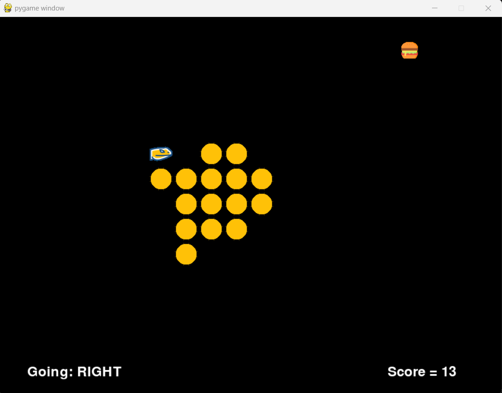
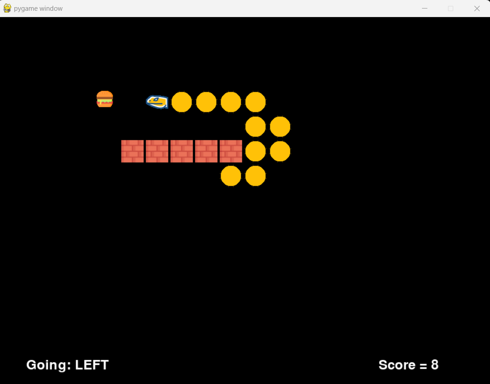
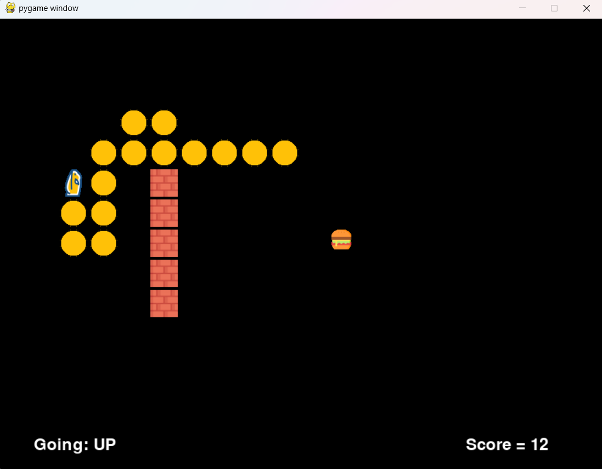

# Fuzzy Logic Snake Game Controller

## Introduction
In this implementation, we enhance the classic gameplay of CLASSIC SNAKE GAME by incorporating a Fuzzy Logic system that makes intelligent decisions about the snake's movements based on:
- Food location
- Snake's current position
- Proximity to the snake's body
- Presence of obstacles



## Game Parameters

### Snake Controllers
The game supports three different control modes:

0. **Manual Controller**
   - Traditional gameplay using arrow keys
   - User controls the snake's movement directly

1. **Fuzzy Rules Controller**
   - Uses optimized fuzzy logic rules
   - Automated snake movement based on environmental factors

2. **Enhanced Fuzzy Rules Controller**
   - Specialized for levels with brick obstacles
   - Improved collision avoidance algorithms

### Game Levels

0. **Basic Arena**
   - No obstacles
   - Only self-collision possible
   

1. **Vertical Bricks**
   - Vertical obstacle pattern
   - Requires navigation through corridors
   

2. **Horizontal Bricks**
   - Horizontal obstacle pattern
   - Similar difficulty to vertical layout
   

3. **L-Shaped Bricks**
   - Most challenging layout
   - Complex obstacle pattern requiring advanced maneuvering
   

## Installation

### Prerequisites
- Python 3.6+
- Windows OS
- Visual Studio C++ build tools (for scikit-fuzzy)
- Latest pip version

### Setup Instructions
1. Navigate to the source code directory (src folder)
2. Open an Administrator command prompt
3. Install dependencies using:
   ```bash
   pip install -r requirements.txt
   ```

## Running the Game
1. Launch the game using:
   ```bash
   python App.py
   ```
2. Press ESC at any time to exit the game

## Credits
Base game implementation adapted from [PythonSpot's Snake Tutorial](https://pythonspot.com/snake-with-pygame/)